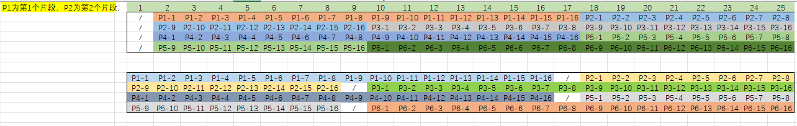

# 水菌挑选

## 输入文件

- `excel` 格式
- `胶图判定` Sheet

### 列信息

|列名|格式|限制性说明|示例|
|---|---|---|---|
|`JP-日期`|`${日期}JP-\d+`|`20050102`格式的日期，合并单元格|`20250607JP-1`|
|`片段名称`|`string`|`TY`为特殊标识字符|`2505EGX_105A0P`|
|`片段长度`|`int`|`<=2000`|`555`|
|`测序引物`|`string`|`；`分割，`T7`为特殊引物|`LD_CF；T7`|
|`备注（to生产）`|`string`|||
|`1`到`25`|`string`|`Y` `/`为特殊标记|`Y`|

### 特殊说明

- 每个 `JP-日期` 对应 `6` 个 `片段名称`, 对应 `4` 行 `1`到`25` 胶图判定结果  
- 每个 `片段名称` 对应 `16` 个胶图判定结果
- 每个胶图判定结果 `Y` 代表有效克隆
- 每行 `1`到`25` 胶图判定结果包含 `1` 个 `Laddar` 结果，用 `/` 表示
- 每个 `JP-日期` 对应的胶图判定结果有 `2` 种可能的排板方式，参考下图
    1. `1` 列均为 `Laddar`，`6` 个 `片段名称` 的各自 `16` 个胶图判定结果按顺序排布
    2. `4` 行 `Laddar` 分别在 `17`、`9`、`17`、`9` 列，用来分隔不同的 `片段名称`

